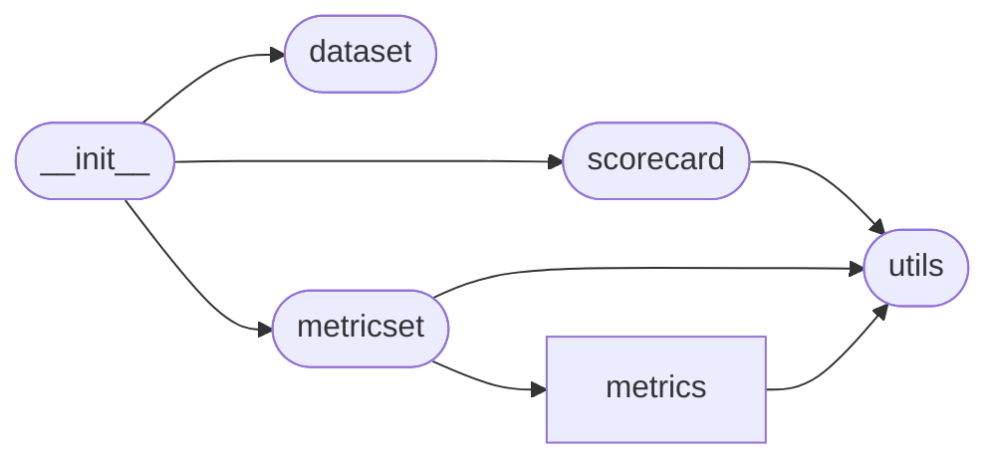

# Code Overview

[_Documentation generated by Documatic_](https://www.documatic.com)

<!---Documatic-section-Codebase Structure Python-start--->
## Codebase Structure Python

The codebase has a single-depth folder structure,
                with 10 code files in total.

<!---Documatic-block-system_architecture-start--->

<!---Documatic-block-system_architecture-end--->

# #
<!---Documatic-section-Codebase Structure Python-end--->

<!---Documatic-section-Key Objects-start--->
## Key Objects

There are exposed imports at level-0
from the source directory (rexmex)

<!---Documatic-block-rexmex-start--->

	
<code>rexmex</code> (Click to Expand!)

* `rexmex.dataset.DatasetReader`
* `rexmex.metricset.ClassificationMetricSet`
* `rexmex.metricset.CoverageMetricSet`
* `rexmex.metricset.MetricSet`
* `rexmex.metricset.RankingMetricSet`
* `rexmex.metricset.RatingMetricSet`
* `rexmex.scorecard.CoverageScoreCard`
* `rexmex.scorecard.ScoreCard`

<!---Documatic-block-rexmex-end--->

# #
<!---Documatic-section-Key Objects-end--->

<!---Documatic-section-Important Functions-start--->
## Important Functions

<!---Documatic-block-important_funcs-start--->
<!---Documatic-block-most_used_funcs-start--->
### Most Utilised Functions

* rexmex.metrics.classification.classifications (2 times)
* [rexmex.metrics.coverage.item_coverage](7-rexmex_metrics.md#rexmex.metrics.coverage.item_coverage) (2 times)
* [rexmex.metrics.coverage.user_coverage](7-rexmex_metrics.md#rexmex.metrics.coverage.user_coverage) (2 times)
* [rexmex.metrics.rating.mean_absolute_error](7-rexmex_metrics.md#rexmex.metrics.rating.mean_absolute_error) (2 times)
* [rexmex.metrics.rating.mean_absolute_percentage_error](7-rexmex_metrics.md#rexmex.metrics.rating.mean_absolute_percentage_error) (2 times)
* [rexmex.metrics.rating.mean_squared_error](7-rexmex_metrics.md#rexmex.metrics.rating.mean_squared_error) (2 times)
* [rexmex.metrics.rating.pearson_correlation_coefficient](7-rexmex_metrics.md#rexmex.metrics.rating.pearson_correlation_coefficient) (2 times)
* [rexmex.metrics.rating.r2_score](7-rexmex_metrics.md#rexmex.metrics.rating.r2_score) (2 times)
* [rexmex.metrics.rating.root_mean_squared_error](7-rexmex_metrics.md#rexmex.metrics.rating.root_mean_squared_error) (2 times)
* [rexmex.metrics.rating.symmetric_mean_absolute_percentage_error](7-rexmex_metrics.md#rexmex.metrics.rating.symmetric_mean_absolute_percentage_error) (2 times)
* [rexmex.utils.binarize](3-rexmex_utils.md#rexmex.utils.binarize) (1 times)
* [rexmex.utils.normalize](3-rexmex_utils.md#rexmex.utils.normalize) (1 times)
* [rexmex.metrics.classification.accuracy_score](7-rexmex_metrics.md#rexmex.metrics.classification.accuracy_score) (1 times)
* [rexmex.metrics.classification.average_precision_score](7-rexmex_metrics.md#rexmex.metrics.classification.average_precision_score) (1 times)
* [rexmex.metrics.classification.balanced_accuracy_score](7-rexmex_metrics.md#rexmex.metrics.classification.balanced_accuracy_score) (1 times)
* [rexmex.metrics.classification.condition_negative](7-rexmex_metrics.md#rexmex.metrics.classification.condition_negative) (1 times)
* [rexmex.metrics.classification.condition_positive](7-rexmex_metrics.md#rexmex.metrics.classification.condition_positive) (1 times)
* [rexmex.metrics.classification.critical_success_index](7-rexmex_metrics.md#rexmex.metrics.classification.critical_success_index) (1 times)
* [rexmex.metrics.classification.diagnostic_odds_ratio](7-rexmex_metrics.md#rexmex.metrics.classification.diagnostic_odds_ratio) (1 times)
* [rexmex.metrics.classification.f1_score](7-rexmex_metrics.md#rexmex.metrics.classification.f1_score) (1 times)
* [rexmex.metrics.classification.fall_out](7-rexmex_metrics.md#rexmex.metrics.classification.fall_out) (1 times)
* [rexmex.metrics.classification.false_discovery_rate](7-rexmex_metrics.md#rexmex.metrics.classification.false_discovery_rate) (1 times)
* [rexmex.metrics.classification.false_negative](7-rexmex_metrics.md#rexmex.metrics.classification.false_negative) (1 times)
* [rexmex.metrics.classification.false_negative_rate](7-rexmex_metrics.md#rexmex.metrics.classification.false_negative_rate) (1 times)
* [rexmex.metrics.classification.false_omission_rate](7-rexmex_metrics.md#rexmex.metrics.classification.false_omission_rate) (1 times)
<!---Documatic-block-most_used_funcs-end--->

<!---Documatic-block-end_user_funcs-start--->
### End User Exposed Functions

* [rexmex.metricset.RatingMetricSet](7-rexmex_metrics.md#rexmex.metricset.RatingMetricSet)
* [rexmex.scorecard.CoverageScoreCard](5-rexmex_scorecard.md#rexmex.scorecard.CoverageScoreCard)
* [rexmex.metricset.MetricSet](7-rexmex_metrics.md#rexmex.metricset.MetricSet)
* [rexmex.dataset.DatasetReader](4-rexmex_dataset.md#rexmex.dataset.DatasetReader)
* [rexmex.scorecard.ScoreCard](5-rexmex_scorecard.md#rexmex.scorecard.ScoreCard)
* [rexmex.metricset.CoverageMetricSet](7-rexmex_metrics.md#rexmex.metricset.CoverageMetricSet)
* [rexmex.metricset.RankingMetricSet](7-rexmex_metrics.md#rexmex.metricset.RankingMetricSet)
* [rexmex.metricset.ClassificationMetricSet](7-rexmex_metrics.md#rexmex.metricset.ClassificationMetricSet)
<!---Documatic-block-end_user_funcs-end--->
<!---Documatic-block-important_funcs-end--->

# #
<!---Documatic-section-Important Functions-end--->

<!---Documatic-section-File IO-start--->
## File IO

<!---Documatic-block-file_io-start--->
The following files have file read operations

<!---Documatic-block-rexmex-start--->

	
<code>rexmex</code> (Click to Expand!)

* rexmex.dataset

<!---Documatic-block-rexmex-end--->
<!---Documatic-block-file_io-end--->

# #
<!---Documatic-section-File IO-end--->

<!---Documatic-section-Class Hierarchy-start--->
## Class Hierarchy

<!---Documatic-block-dict-start--->

	
<code>dict</code> (Click to Expand!)

* [rexmex.metricset.MetricSet](7-rexmex_metrics.md#rexmex.metricset.MetricSet)

<!---Documatic-block-dict-end--->

<!---Documatic-block-object-start--->

	
<code>object</code> (Click to Expand!)

* [rexmex.dataset.DatasetReader](4-rexmex_dataset.md#rexmex.dataset.DatasetReader)

<!---Documatic-block-object-end--->

<!---Documatic-block-rexmex.metricset.MetricSet-start--->

	
<code>rexmex.metricset.MetricSet</code> (Click to Expand!)

* [rexmex.metricset.ClassificationMetricSet](7-rexmex_metrics.md#rexmex.metricset.ClassificationMetricSet)
* [rexmex.metricset.CoverageMetricSet](7-rexmex_metrics.md#rexmex.metricset.CoverageMetricSet)
* [rexmex.metricset.RankingMetricSet](7-rexmex_metrics.md#rexmex.metricset.RankingMetricSet)
* [rexmex.metricset.RatingMetricSet](7-rexmex_metrics.md#rexmex.metricset.RatingMetricSet)

<!---Documatic-block-rexmex.metricset.MetricSet-end--->

<!---Documatic-block-rexmex.scorecard.ScoreCard-start--->

	
<code>rexmex.scorecard.ScoreCard</code> (Click to Expand!)

* [rexmex.scorecard.CoverageScoreCard](5-rexmex_scorecard.md#rexmex.scorecard.CoverageScoreCard)

<!---Documatic-block-rexmex.scorecard.ScoreCard-end--->

# #
<!---Documatic-section-Class Hierarchy-end--->

[_Documentation generated by Documatic_](https://www.documatic.com)