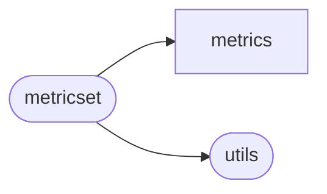

# Rexmex Metricset

[_Documentation generated by Documatic_](https://www.documatic.com)

<!---Documatic-section-Codebase Structure-start--->
## Codebase Structure

<!---Documatic-block-system_architecture-start--->

<!---Documatic-block-system_architecture-end--->

# #
<!---Documatic-section-Codebase Structure-end--->

<!---Documatic-section-rexmex.metricset.RatingMetricSet-start--->
## [rexmex.metricset.RatingMetricSet](7-rexmex_metrics.md#rexmex.metricset.RatingMetricSet)

<!---Documatic-section-RatingMetricSet-start--->
<!---Documatic-block-rexmex.metricset.RatingMetricSet-start--->
<details>
	<summary><code>rexmex.metricset.RatingMetricSet</code> code snippet</summary>

```python
class RatingMetricSet(MetricSet):

    def __init__(self):
        self['mae'] = mean_absolute_error
        self['mse'] = mean_squared_error
        self['rmse'] = root_mean_squared_error
        self['mape'] = mean_absolute_percentage_error
        self['smape'] = symmetric_mean_absolute_percentage_error
        self['r_squared'] = r2_score
        self['pearson_correlation'] = pearson_correlation_coefficient

    def normalize_metrics(self):
        """
        A method to normalize a set of metrics.

        Returns:
            self: The metric set after the metrics were normalized.
        """
        for (name, metric) in self.items():
            self[name] = normalize(metric)
        return self

    def __repr__(self):
        """
        A representation of the RatingMetricSet object.
        """
        return 'RatingMetricSet()'
```
</details>
<!---Documatic-block-rexmex.metricset.RatingMetricSet-end--->
<!---Documatic-section-RatingMetricSet-end--->

# #
<!---Documatic-section-rexmex.metricset.RatingMetricSet-end--->

<!---Documatic-section-rexmex.metricset.MetricSet-start--->
## [rexmex.metricset.MetricSet](7-rexmex_metrics.md#rexmex.metricset.MetricSet)

<!---Documatic-section-MetricSet-start--->
<!---Documatic-block-rexmex.metricset.MetricSet-start--->
<details>
	<summary><code>rexmex.metricset.MetricSet</code> code snippet</summary>

```python
class MetricSet(dict):

    def filter_metrics(self, filter: Collection[str]):
        """
        A method to keep a list of metrics.

        Args:
            filter: A list of metric names to keep.
        Returns:
            self: The metric set after the metrics were filtered out.
        """
        for name in list(self.keys()):
            if name not in filter:
                del self[name]
        return self

    def add_metrics(self, metrics: List[Tuple]):
        """
        A method to add metric functions from a list of function names and functions.

        Args:
            metrics (List[Tuple]): A list of metric name and metric function tuples.
        Returns:
            self: The metric set after the metrics were added.
        """
        for metric in metrics:
            (metric_name, metric_function) = metric
            self[metric_name] = metric_function
        return self

    def __repr__(self):
        """
        A representation of the MetricSet object.
        """
        return 'MetricSet()'

    def print_metrics(self):
        """
        Printing the name of metrics.
        """
        print({k for k in self.keys()})

    def __add__(self, other_metric_set):
        """
        Adding two metric sets together with the addition syntactic sugar operator.

        Args:
            other_metric_set (rexmex.metricset.MetricSet): Metric set added from the right.
        Returns:
            new_metric_set (rexmex.metricset.MetricSet): The combined metric set.
        """
        new_metric_set = self
        for (name, metric) in other_metric_set.items():
            new_metric_set[name] = metric
        return new_metric_set
```
</details>
<!---Documatic-block-rexmex.metricset.MetricSet-end--->
<!---Documatic-section-MetricSet-end--->

# #
<!---Documatic-section-rexmex.metricset.MetricSet-end--->

<!---Documatic-section-rexmex.metricset.CoverageMetricSet-start--->
## [rexmex.metricset.CoverageMetricSet](7-rexmex_metrics.md#rexmex.metricset.CoverageMetricSet)

<!---Documatic-section-CoverageMetricSet-start--->
<!---Documatic-block-rexmex.metricset.CoverageMetricSet-start--->
<details>
	<summary><code>rexmex.metricset.CoverageMetricSet</code> code snippet</summary>

```python
class CoverageMetricSet(MetricSet):

    def __init__(self):
        self['item_coverage'] = item_coverage
        self['user_coverage'] = user_coverage

    def __repr__(self):
        """
        A representation of the CoverageMetricSet object.
        """
        return 'CoverageMetricSet()'
```
</details>
<!---Documatic-block-rexmex.metricset.CoverageMetricSet-end--->
<!---Documatic-section-CoverageMetricSet-end--->

# #
<!---Documatic-section-rexmex.metricset.CoverageMetricSet-end--->

<!---Documatic-section-rexmex.metricset.RankingMetricSet-start--->
## [rexmex.metricset.RankingMetricSet](7-rexmex_metrics.md#rexmex.metricset.RankingMetricSet)

<!---Documatic-section-RankingMetricSet-start--->
<!---Documatic-block-rexmex.metricset.RankingMetricSet-start--->
<details>
	<summary><code>rexmex.metricset.RankingMetricSet</code> code snippet</summary>

```python
class RankingMetricSet(MetricSet):

    def __repr__(self):
        """
        A representation of the RankingMetricSet object.
        """
        return 'RankingMetricSet()'
```
</details>
<!---Documatic-block-rexmex.metricset.RankingMetricSet-end--->
<!---Documatic-section-RankingMetricSet-end--->

# #
<!---Documatic-section-rexmex.metricset.RankingMetricSet-end--->

<!---Documatic-section-rexmex.metricset.ClassificationMetricSet-start--->
## [rexmex.metricset.ClassificationMetricSet](7-rexmex_metrics.md#rexmex.metricset.ClassificationMetricSet)

<!---Documatic-section-ClassificationMetricSet-start--->
<!---Documatic-block-rexmex.metricset.ClassificationMetricSet-start--->
<details>
	<summary><code>rexmex.metricset.ClassificationMetricSet</code> code snippet</summary>

```python
class ClassificationMetricSet(MetricSet):

    def __init__(self):
        super().__init__()
        for func in classifications:
            name = func.__name__
            if name.endswith('_score'):
                name = name[:-len('_score')]
            if func.binarize:
                func = binarize(func)
            self[name] = func

    def __repr__(self):
        """
        A representation of the ClassificationMetricSet object.
        """
        return 'ClassificationMetricSet()'
```
</details>
<!---Documatic-block-rexmex.metricset.ClassificationMetricSet-end--->
<!---Documatic-section-ClassificationMetricSet-end--->

# #
<!---Documatic-section-rexmex.metricset.ClassificationMetricSet-end--->

[_Documentation generated by Documatic_](https://www.documatic.com)