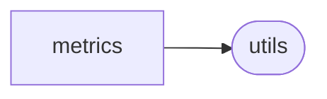

# Rexmex Metrics

[_Documentation generated by Documatic_](https://www.documatic.com)

<!---Documatic-section-Codebase Structure-start--->
## Codebase Structure

<!---Documatic-block-system_architecture-start--->

<!---Documatic-block-system_architecture-end--->

# #
<!---Documatic-section-Codebase Structure-end--->

<!---Documatic-section-rexmex.metrics.coverage.item_coverage-start--->
## [rexmex.metrics.coverage.item_coverage](7-rexmex_metrics.md#rexmex.metrics.coverage.item_coverage)

<!---Documatic-section-item_coverage-start--->
<!---Documatic-block-rexmex.metrics.coverage.item_coverage-start--->
<details>
	<summary><code>rexmex.metrics.coverage.item_coverage</code> code snippet</summary>

```python
def item_coverage(possible_users_items: Tuple[List[Union[int, str]], List[Union[int, str]]], recommendations: List[Tuple[Union[int, str], Union[int, str]]]) -> float:
    if len(possible_users_items) != 2:
        raise ValueError('possible_users_items must be of length 2: [users, items]')
    if np.any([len(x) == 0 for x in possible_users_items]):
        raise ValueError('possible_users_items cannot hold empty lists!')
    possible_items = set(possible_users_items[1])
    items_with_recommendations = set([x[1] for x in recommendations])
    items_without_recommendations = possible_items.difference(items_with_recommendations)
    item_cov = 1 - len(items_without_recommendations) / len(possible_items)
    return round(item_cov, 3)
```
</details>
<!---Documatic-block-rexmex.metrics.coverage.item_coverage-end--->
<!---Documatic-section-item_coverage-end--->

# #
<!---Documatic-section-rexmex.metrics.coverage.item_coverage-end--->

<!---Documatic-section-rexmex.metrics.coverage.user_coverage-start--->
## [rexmex.metrics.coverage.user_coverage](7-rexmex_metrics.md#rexmex.metrics.coverage.user_coverage)

<!---Documatic-section-user_coverage-start--->
<!---Documatic-block-rexmex.metrics.coverage.user_coverage-start--->
<details>
	<summary><code>rexmex.metrics.coverage.user_coverage</code> code snippet</summary>

```python
def user_coverage(possible_users_items: Tuple[List[Union[int, str]], List[Union[int, str]]], recommendations: List[Tuple[Union[int, str], Union[int, str]]]) -> float:
    if len(possible_users_items) != 2:
        raise ValueError('possible_users_items must be of length 2: [users, items]')
    if np.any([len(x) == 0 for x in possible_users_items]):
        raise ValueError('possible_users_items cannot hold empty lists!')
    possible_users = set(possible_users_items[0])
    users_with_recommendations = set([x[0] for x in recommendations])
    users_without_recommendations = possible_users.difference(users_with_recommendations)
    user_cov = 1 - len(users_without_recommendations) / len(possible_users)
    return round(user_cov, 3)
```
</details>
<!---Documatic-block-rexmex.metrics.coverage.user_coverage-end--->
<!---Documatic-section-user_coverage-end--->

# #
<!---Documatic-section-rexmex.metrics.coverage.user_coverage-end--->

<!---Documatic-section-rexmex.metrics.rating.mean_absolute_error-start--->
## [rexmex.metrics.rating.mean_absolute_error](7-rexmex_metrics.md#rexmex.metrics.rating.mean_absolute_error)

<!---Documatic-section-mean_absolute_error-start--->
<!---Documatic-block-rexmex.metrics.rating.mean_absolute_error-start--->
<details>
	<summary><code>rexmex.metrics.rating.mean_absolute_error</code> code snippet</summary>

```python
def mean_absolute_error(y_true: np.array, y_score: np.array) -> float:
    mae = sklearn.metrics.mean_absolute_error(y_true, y_score)
    return mae
```
</details>
<!---Documatic-block-rexmex.metrics.rating.mean_absolute_error-end--->
<!---Documatic-section-mean_absolute_error-end--->

# #
<!---Documatic-section-rexmex.metrics.rating.mean_absolute_error-end--->

<!---Documatic-section-rexmex.metrics.rating.mean_absolute_percentage_error-start--->
## [rexmex.metrics.rating.mean_absolute_percentage_error](7-rexmex_metrics.md#rexmex.metrics.rating.mean_absolute_percentage_error)

<!---Documatic-section-mean_absolute_percentage_error-start--->
<!---Documatic-block-rexmex.metrics.rating.mean_absolute_percentage_error-start--->
<details>
	<summary><code>rexmex.metrics.rating.mean_absolute_percentage_error</code> code snippet</summary>

```python
def mean_absolute_percentage_error(y_true: np.array, y_score: np.array) -> float:
    mape = sklearn.metrics.mean_absolute_percentage_error(y_true, y_score)
    return mape
```
</details>
<!---Documatic-block-rexmex.metrics.rating.mean_absolute_percentage_error-end--->
<!---Documatic-section-mean_absolute_percentage_error-end--->

# #
<!---Documatic-section-rexmex.metrics.rating.mean_absolute_percentage_error-end--->

<!---Documatic-section-rexmex.metrics.rating.mean_squared_error-start--->
## [rexmex.metrics.rating.mean_squared_error](7-rexmex_metrics.md#rexmex.metrics.rating.mean_squared_error)

<!---Documatic-section-mean_squared_error-start--->
<!---Documatic-block-rexmex.metrics.rating.mean_squared_error-start--->
<details>
	<summary><code>rexmex.metrics.rating.mean_squared_error</code> code snippet</summary>

```python
def mean_squared_error(y_true: np.array, y_score: np.array) -> float:
    mse = sklearn.metrics.mean_squared_error(y_true, y_score)
    return mse
```
</details>
<!---Documatic-block-rexmex.metrics.rating.mean_squared_error-end--->
<!---Documatic-section-mean_squared_error-end--->

# #
<!---Documatic-section-rexmex.metrics.rating.mean_squared_error-end--->

<!---Documatic-section-rexmex.metrics.rating.pearson_correlation_coefficient-start--->
## [rexmex.metrics.rating.pearson_correlation_coefficient](7-rexmex_metrics.md#rexmex.metrics.rating.pearson_correlation_coefficient)

<!---Documatic-section-pearson_correlation_coefficient-start--->
<!---Documatic-block-rexmex.metrics.rating.pearson_correlation_coefficient-start--->
<details>
	<summary><code>rexmex.metrics.rating.pearson_correlation_coefficient</code> code snippet</summary>

```python
def pearson_correlation_coefficient(y_true: np.array, y_score: np.array) -> float:
    rho = scipy.stats.stats.pearsonr(y_true, y_score)
    return rho[0]
```
</details>
<!---Documatic-block-rexmex.metrics.rating.pearson_correlation_coefficient-end--->
<!---Documatic-section-pearson_correlation_coefficient-end--->

# #
<!---Documatic-section-rexmex.metrics.rating.pearson_correlation_coefficient-end--->

<!---Documatic-section-rexmex.metrics.rating.r2_score-start--->
## [rexmex.metrics.rating.r2_score](7-rexmex_metrics.md#rexmex.metrics.rating.r2_score)

<!---Documatic-section-r2_score-start--->
<!---Documatic-block-rexmex.metrics.rating.r2_score-start--->
<details>
	<summary><code>rexmex.metrics.rating.r2_score</code> code snippet</summary>

```python
def r2_score(y_true: np.array, y_score: np.array) -> float:
    r2 = sklearn.metrics.r2_score(y_true, y_score)
    return r2
```
</details>
<!---Documatic-block-rexmex.metrics.rating.r2_score-end--->
<!---Documatic-section-r2_score-end--->

# #
<!---Documatic-section-rexmex.metrics.rating.r2_score-end--->

<!---Documatic-section-rexmex.metrics.rating.root_mean_squared_error-start--->
## [rexmex.metrics.rating.root_mean_squared_error](7-rexmex_metrics.md#rexmex.metrics.rating.root_mean_squared_error)

<!---Documatic-section-root_mean_squared_error-start--->


### Object Calls

* [rexmex.metrics.rating.mean_squared_error](7-rexmex_metrics.md#rexmex.metrics.rating.mean_squared_error)

<!---Documatic-block-rexmex.metrics.rating.root_mean_squared_error-start--->
<details>
	<summary><code>rexmex.metrics.rating.root_mean_squared_error</code> code snippet</summary>

```python
def root_mean_squared_error(y_true: np.array, y_score: np.array) -> float:
    rmse = mean_squared_error(y_true, y_score) ** 0.5
    return rmse
```
</details>
<!---Documatic-block-rexmex.metrics.rating.root_mean_squared_error-end--->
<!---Documatic-section-root_mean_squared_error-end--->

# #
<!---Documatic-section-rexmex.metrics.rating.root_mean_squared_error-end--->

<!---Documatic-section-rexmex.metrics.rating.symmetric_mean_absolute_percentage_error-start--->
## [rexmex.metrics.rating.symmetric_mean_absolute_percentage_error](7-rexmex_metrics.md#rexmex.metrics.rating.symmetric_mean_absolute_percentage_error)

<!---Documatic-section-symmetric_mean_absolute_percentage_error-start--->
<!---Documatic-block-rexmex.metrics.rating.symmetric_mean_absolute_percentage_error-start--->
<details>
	<summary><code>rexmex.metrics.rating.symmetric_mean_absolute_percentage_error</code> code snippet</summary>

```python
def symmetric_mean_absolute_percentage_error(y_true: np.array, y_score: np.array) -> float:
    smape = 100 * np.mean(np.abs(y_score - y_true) / ((np.abs(y_score) + np.abs(y_true)) / 2))
    return smape
```
</details>
<!---Documatic-block-rexmex.metrics.rating.symmetric_mean_absolute_percentage_error-end--->
<!---Documatic-section-symmetric_mean_absolute_percentage_error-end--->

# #
<!---Documatic-section-rexmex.metrics.rating.symmetric_mean_absolute_percentage_error-end--->

<!---Documatic-section-rexmex.metrics.classification.accuracy_score-start--->
## [rexmex.metrics.classification.accuracy_score](7-rexmex_metrics.md#rexmex.metrics.classification.accuracy_score)

<!---Documatic-section-accuracy_score-start--->
<!---Documatic-block-rexmex.metrics.classification.accuracy_score-start--->
<details>
	<summary><code>rexmex.metrics.classification.accuracy_score</code> code snippet</summary>

```python
@classifications.annotate(name='Accuracy', lower=0.0, upper=1.0, higher_is_better=True, description='(TP + TN) / (TP + TN + FP + FN)', link='https://en.wikipedia.org/wiki/Accuracy', binarize=True)
def accuracy_score(y_true: np.array, y_score: np.array) -> float:
    accuracy = sklearn.metrics.accuracy_score(y_true, y_score)
    return accuracy
```
</details>
<!---Documatic-block-rexmex.metrics.classification.accuracy_score-end--->
<!---Documatic-section-accuracy_score-end--->

# #
<!---Documatic-section-rexmex.metrics.classification.accuracy_score-end--->

<!---Documatic-section-rexmex.metrics.classification.average_precision_score-start--->
## [rexmex.metrics.classification.average_precision_score](7-rexmex_metrics.md#rexmex.metrics.classification.average_precision_score)

<!---Documatic-section-average_precision_score-start--->
<!---Documatic-block-rexmex.metrics.classification.average_precision_score-start--->
<details>
	<summary><code>rexmex.metrics.classification.average_precision_score</code> code snippet</summary>

```python
@classifications.annotate(name='Average precision', lower=0.0, upper=1.0, higher_is_better=True, description='A summary statistic over the precision-recall curve', link='https://scikit-learn.org/stable/modules/generated/sklearn.metrics.average_precision_score.html')
def average_precision_score(y_true: np.array, y_score: np.array) -> float:
    average_precision = sklearn.metrics.average_precision_score(y_true, y_score)
    return average_precision
```
</details>
<!---Documatic-block-rexmex.metrics.classification.average_precision_score-end--->
<!---Documatic-section-average_precision_score-end--->

# #
<!---Documatic-section-rexmex.metrics.classification.average_precision_score-end--->

<!---Documatic-section-rexmex.metrics.classification.balanced_accuracy_score-start--->
## [rexmex.metrics.classification.balanced_accuracy_score](7-rexmex_metrics.md#rexmex.metrics.classification.balanced_accuracy_score)

<!---Documatic-section-balanced_accuracy_score-start--->
<!---Documatic-block-rexmex.metrics.classification.balanced_accuracy_score-start--->
<details>
	<summary><code>rexmex.metrics.classification.balanced_accuracy_score</code> code snippet</summary>

```python
@classifications.annotate(name='Balanced accuracy', lower=0.0, upper=1.0, higher_is_better=True, description='An adjusted version of the accuracy for imbalanced datasets', link='https://scikit-learn.org/stable/modules/generated/sklearn.metrics.balanced_accuracy_score.html', binarize=True)
def balanced_accuracy_score(y_true: np.array, y_score: np.array) -> float:
    balanced_accuracy = sklearn.metrics.balanced_accuracy_score(y_true, y_score)
    return balanced_accuracy
```
</details>
<!---Documatic-block-rexmex.metrics.classification.balanced_accuracy_score-end--->
<!---Documatic-section-balanced_accuracy_score-end--->

# #
<!---Documatic-section-rexmex.metrics.classification.balanced_accuracy_score-end--->

<!---Documatic-section-rexmex.metrics.classification.condition_negative-start--->
## [rexmex.metrics.classification.condition_negative](7-rexmex_metrics.md#rexmex.metrics.classification.condition_negative)

<!---Documatic-section-condition_negative-start--->
<!---Documatic-block-rexmex.metrics.classification.condition_negative-start--->
<details>
	<summary><code>rexmex.metrics.classification.condition_negative</code> code snippet</summary>

```python
def condition_negative(y_true: np.array) -> float:
    cn = np.sum(1 - y_true)
    return cn
```
</details>
<!---Documatic-block-rexmex.metrics.classification.condition_negative-end--->
<!---Documatic-section-condition_negative-end--->

# #
<!---Documatic-section-rexmex.metrics.classification.condition_negative-end--->

<!---Documatic-section-rexmex.metrics.classification.condition_positive-start--->
## [rexmex.metrics.classification.condition_positive](7-rexmex_metrics.md#rexmex.metrics.classification.condition_positive)

<!---Documatic-section-condition_positive-start--->
<!---Documatic-block-rexmex.metrics.classification.condition_positive-start--->
<details>
	<summary><code>rexmex.metrics.classification.condition_positive</code> code snippet</summary>

```python
def condition_positive(y_true: np.array) -> float:
    cp = np.sum(y_true)
    return cp
```
</details>
<!---Documatic-block-rexmex.metrics.classification.condition_positive-end--->
<!---Documatic-section-condition_positive-end--->

# #
<!---Documatic-section-rexmex.metrics.classification.condition_positive-end--->

<!---Documatic-section-rexmex.metrics.classification.critical_success_index-start--->
## [rexmex.metrics.classification.critical_success_index](7-rexmex_metrics.md#rexmex.metrics.classification.critical_success_index)

<!---Documatic-section-critical_success_index-start--->


### Object Calls

* [rexmex.metrics.classification.threat_score](7-rexmex_metrics.md#rexmex.metrics.classification.threat_score)

<!---Documatic-block-rexmex.metrics.classification.critical_success_index-start--->
<details>
	<summary><code>rexmex.metrics.classification.critical_success_index</code> code snippet</summary>

```python
@classifications.duplicate(threat_score)
def critical_success_index(y_true: np.array, y_score: np.array) -> float:
    ts = threat_score(y_true, y_score)
    return ts
```
</details>
<!---Documatic-block-rexmex.metrics.classification.critical_success_index-end--->
<!---Documatic-section-critical_success_index-end--->

# #
<!---Documatic-section-rexmex.metrics.classification.critical_success_index-end--->

<!---Documatic-section-rexmex.metrics.classification.diagnostic_odds_ratio-start--->
## [rexmex.metrics.classification.diagnostic_odds_ratio](7-rexmex_metrics.md#rexmex.metrics.classification.diagnostic_odds_ratio)

<!---Documatic-section-diagnostic_odds_ratio-start--->


### Object Calls

* [rexmex.metrics.classification.negative_likelihood_ratio](7-rexmex_metrics.md#rexmex.metrics.classification.negative_likelihood_ratio)
* [rexmex.metrics.classification.positive_likelihood_ratio](7-rexmex_metrics.md#rexmex.metrics.classification.positive_likelihood_ratio)

<!---Documatic-block-rexmex.metrics.classification.diagnostic_odds_ratio-start--->
<details>
	<summary><code>rexmex.metrics.classification.diagnostic_odds_ratio</code> code snippet</summary>

```python
@classifications.annotate(lower=0.0, upper=float('inf'), upper_inclusive=False, higher_is_better=True, description='LR+/LR-', link='https://en.wikipedia.org/wiki/Diagnostic_odds_ratio')
def diagnostic_odds_ratio(y_true: np.array, y_score: np.array) -> float:
    lr_minus = negative_likelihood_ratio(y_true, y_score)
    lr_plus = positive_likelihood_ratio(y_true, y_score)
    dor = lr_plus / lr_minus
    return dor
```
</details>
<!---Documatic-block-rexmex.metrics.classification.diagnostic_odds_ratio-end--->
<!---Documatic-section-diagnostic_odds_ratio-end--->

# #
<!---Documatic-section-rexmex.metrics.classification.diagnostic_odds_ratio-end--->

<!---Documatic-section-rexmex.metrics.classification.f1_score-start--->
## [rexmex.metrics.classification.f1_score](7-rexmex_metrics.md#rexmex.metrics.classification.f1_score)

<!---Documatic-section-f1_score-start--->
<!---Documatic-block-rexmex.metrics.classification.f1_score-start--->
<details>
	<summary><code>rexmex.metrics.classification.f1_score</code> code snippet</summary>

```python
@classifications.annotate(name='F_1', lower=0.0, upper=1.0, higher_is_better=True, description='2TP / (2TP + FP + FN)', link='https://en.wikipedia.org/wiki/F1_score', binarize=True)
def f1_score(y_true: np.array, y_score: np.array) -> float:
    f1 = sklearn.metrics.f1_score(y_true, y_score)
    return f1
```
</details>
<!---Documatic-block-rexmex.metrics.classification.f1_score-end--->
<!---Documatic-section-f1_score-end--->

# #
<!---Documatic-section-rexmex.metrics.classification.f1_score-end--->

<!---Documatic-section-rexmex.metrics.classification.fall_out-start--->
## [rexmex.metrics.classification.fall_out](7-rexmex_metrics.md#rexmex.metrics.classification.fall_out)

<!---Documatic-section-fall_out-start--->


### Object Calls

* [rexmex.metrics.classification.false_positive](7-rexmex_metrics.md#rexmex.metrics.classification.false_positive)
* [rexmex.metrics.classification.condition_negative](7-rexmex_metrics.md#rexmex.metrics.classification.condition_negative)

<!---Documatic-block-rexmex.metrics.classification.fall_out-start--->
<details>
	<summary><code>rexmex.metrics.classification.fall_out</code> code snippet</summary>

```python
@classifications.duplicate(false_positive_rate)
def fall_out(y_true: np.array, y_score: np.array) -> float:
    fp = false_positive(y_true, y_score)
    n = condition_negative(y_true)
    fpr = fp / n
    return fpr
```
</details>
<!---Documatic-block-rexmex.metrics.classification.fall_out-end--->
<!---Documatic-section-fall_out-end--->

# #
<!---Documatic-section-rexmex.metrics.classification.fall_out-end--->

<!---Documatic-section-rexmex.metrics.classification.false_discovery_rate-start--->
## [rexmex.metrics.classification.false_discovery_rate](7-rexmex_metrics.md#rexmex.metrics.classification.false_discovery_rate)

<!---Documatic-section-false_discovery_rate-start--->


### Object Calls

* [rexmex.metrics.classification.false_positive](7-rexmex_metrics.md#rexmex.metrics.classification.false_positive)
* [rexmex.metrics.classification.true_positive](7-rexmex_metrics.md#rexmex.metrics.classification.true_positive)

<!---Documatic-block-rexmex.metrics.classification.false_discovery_rate-start--->
<details>
	<summary><code>rexmex.metrics.classification.false_discovery_rate</code> code snippet</summary>

```python
@classifications.annotate(lower=0.0, upper=1.0, higher_is_better=False, description='FP / (FP + TP)', link='https://en.wikipedia.org/wiki/False_discovery_rate')
def false_discovery_rate(y_true: np.array, y_score: np.array) -> float:
    fp = false_positive(y_true, y_score)
    tp = true_positive(y_true, y_score)
    fdr = fp / (fp + tp)
    return fdr
```
</details>
<!---Documatic-block-rexmex.metrics.classification.false_discovery_rate-end--->
<!---Documatic-section-false_discovery_rate-end--->

# #
<!---Documatic-section-rexmex.metrics.classification.false_discovery_rate-end--->

<!---Documatic-section-rexmex.metrics.classification.false_negative-start--->
## [rexmex.metrics.classification.false_negative](7-rexmex_metrics.md#rexmex.metrics.classification.false_negative)

<!---Documatic-section-false_negative-start--->
<!---Documatic-block-rexmex.metrics.classification.false_negative-start--->
<details>
	<summary><code>rexmex.metrics.classification.false_negative</code> code snippet</summary>

```python
def false_negative(y_true: np.array, y_score: np.array) -> float:
    y_score = 1 - y_score
    fn = np.sum(y_score[y_true == 1])
    return fn
```
</details>
<!---Documatic-block-rexmex.metrics.classification.false_negative-end--->
<!---Documatic-section-false_negative-end--->

# #
<!---Documatic-section-rexmex.metrics.classification.false_negative-end--->

<!---Documatic-section-rexmex.metrics.classification.false_negative_rate-start--->
## [rexmex.metrics.classification.false_negative_rate](7-rexmex_metrics.md#rexmex.metrics.classification.false_negative_rate)

<!---Documatic-section-false_negative_rate-start--->


### Object Calls

* [rexmex.metrics.classification.miss_rate](7-rexmex_metrics.md#rexmex.metrics.classification.miss_rate)

<!---Documatic-block-rexmex.metrics.classification.false_negative_rate-start--->
<details>
	<summary><code>rexmex.metrics.classification.false_negative_rate</code> code snippet</summary>

```python
@classifications.annotate(lower=0.0, upper=1.0, higher_is_better=False, description='FN / (FN + TP)', link='https://en.wikipedia.org/wiki/Type_I_and_type_II_errors#False_positive_and_false_negative_rates')
def false_negative_rate(y_true: np.array, y_score: np.array) -> float:
    fnr = miss_rate(y_true, y_score)
    return fnr
```
</details>
<!---Documatic-block-rexmex.metrics.classification.false_negative_rate-end--->
<!---Documatic-section-false_negative_rate-end--->

# #
<!---Documatic-section-rexmex.metrics.classification.false_negative_rate-end--->

<!---Documatic-section-rexmex.metrics.classification.false_omission_rate-start--->
## [rexmex.metrics.classification.false_omission_rate](7-rexmex_metrics.md#rexmex.metrics.classification.false_omission_rate)

<!---Documatic-section-false_omission_rate-start--->


### Object Calls

* [rexmex.metrics.classification.false_negative](7-rexmex_metrics.md#rexmex.metrics.classification.false_negative)
* [rexmex.metrics.classification.true_negative](7-rexmex_metrics.md#rexmex.metrics.classification.true_negative)

<!---Documatic-block-rexmex.metrics.classification.false_omission_rate-start--->
<details>
	<summary><code>rexmex.metrics.classification.false_omission_rate</code> code snippet</summary>

```python
@classifications.annotate(lower=0.0, upper=1.0, higher_is_better=False, description='FN / (FN + TN)', link='https://en.wikipedia.org/wiki/Positive_and_negative_predictive_values')
def false_omission_rate(y_true: np.array, y_score: np.array) -> float:
    fn = false_negative(y_true, y_score)
    tn = true_negative(y_true, y_score)
    fomr = fn / (fn + tn)
    return fomr
```
</details>
<!---Documatic-block-rexmex.metrics.classification.false_omission_rate-end--->
<!---Documatic-section-false_omission_rate-end--->

# #
<!---Documatic-section-rexmex.metrics.classification.false_omission_rate-end--->

<!---Documatic-section-rexmex.metricset.RatingMetricSet-start--->
## [rexmex.metricset.RatingMetricSet](7-rexmex_metrics.md#rexmex.metricset.RatingMetricSet)

<!---Documatic-section-RatingMetricSet-start--->
<!---Documatic-block-rexmex.metricset.RatingMetricSet-start--->
<details>
	<summary><code>rexmex.metricset.RatingMetricSet</code> code snippet</summary>

```python
class RatingMetricSet(MetricSet):

    def __init__(self):
        self['mae'] = mean_absolute_error
        self['mse'] = mean_squared_error
        self['rmse'] = root_mean_squared_error
        self['mape'] = mean_absolute_percentage_error
        self['smape'] = symmetric_mean_absolute_percentage_error
        self['r_squared'] = r2_score
        self['pearson_correlation'] = pearson_correlation_coefficient

    def normalize_metrics(self):
        """
        A method to normalize a set of metrics.

        Returns:
            self: The metric set after the metrics were normalized.
        """
        for (name, metric) in self.items():
            self[name] = normalize(metric)
        return self

    def __repr__(self):
        """
        A representation of the RatingMetricSet object.
        """
        return 'RatingMetricSet()'
```
</details>
<!---Documatic-block-rexmex.metricset.RatingMetricSet-end--->
<!---Documatic-section-RatingMetricSet-end--->

# #
<!---Documatic-section-rexmex.metricset.RatingMetricSet-end--->

<!---Documatic-section-rexmex.metricset.MetricSet-start--->
## [rexmex.metricset.MetricSet](7-rexmex_metrics.md#rexmex.metricset.MetricSet)

<!---Documatic-section-MetricSet-start--->
<!---Documatic-block-rexmex.metricset.MetricSet-start--->
<details>
	<summary><code>rexmex.metricset.MetricSet</code> code snippet</summary>

```python
class MetricSet(dict):

    def filter_metrics(self, filter: Collection[str]):
        """
        A method to keep a list of metrics.

        Args:
            filter: A list of metric names to keep.
        Returns:
            self: The metric set after the metrics were filtered out.
        """
        for name in list(self.keys()):
            if name not in filter:
                del self[name]
        return self

    def add_metrics(self, metrics: List[Tuple]):
        """
        A method to add metric functions from a list of function names and functions.

        Args:
            metrics (List[Tuple]): A list of metric name and metric function tuples.
        Returns:
            self: The metric set after the metrics were added.
        """
        for metric in metrics:
            (metric_name, metric_function) = metric
            self[metric_name] = metric_function
        return self

    def __repr__(self):
        """
        A representation of the MetricSet object.
        """
        return 'MetricSet()'

    def print_metrics(self):
        """
        Printing the name of metrics.
        """
        print({k for k in self.keys()})

    def __add__(self, other_metric_set):
        """
        Adding two metric sets together with the addition syntactic sugar operator.

        Args:
            other_metric_set (rexmex.metricset.MetricSet): Metric set added from the right.
        Returns:
            new_metric_set (rexmex.metricset.MetricSet): The combined metric set.
        """
        new_metric_set = self
        for (name, metric) in other_metric_set.items():
            new_metric_set[name] = metric
        return new_metric_set
```
</details>
<!---Documatic-block-rexmex.metricset.MetricSet-end--->
<!---Documatic-section-MetricSet-end--->

# #
<!---Documatic-section-rexmex.metricset.MetricSet-end--->

<!---Documatic-section-rexmex.metricset.CoverageMetricSet-start--->
## [rexmex.metricset.CoverageMetricSet](7-rexmex_metrics.md#rexmex.metricset.CoverageMetricSet)

<!---Documatic-section-CoverageMetricSet-start--->
<!---Documatic-block-rexmex.metricset.CoverageMetricSet-start--->
<details>
	<summary><code>rexmex.metricset.CoverageMetricSet</code> code snippet</summary>

```python
class CoverageMetricSet(MetricSet):

    def __init__(self):
        self['item_coverage'] = item_coverage
        self['user_coverage'] = user_coverage

    def __repr__(self):
        """
        A representation of the CoverageMetricSet object.
        """
        return 'CoverageMetricSet()'
```
</details>
<!---Documatic-block-rexmex.metricset.CoverageMetricSet-end--->
<!---Documatic-section-CoverageMetricSet-end--->

# #
<!---Documatic-section-rexmex.metricset.CoverageMetricSet-end--->

<!---Documatic-section-rexmex.metricset.RankingMetricSet-start--->
## [rexmex.metricset.RankingMetricSet](7-rexmex_metrics.md#rexmex.metricset.RankingMetricSet)

<!---Documatic-section-RankingMetricSet-start--->
<!---Documatic-block-rexmex.metricset.RankingMetricSet-start--->
<details>
	<summary><code>rexmex.metricset.RankingMetricSet</code> code snippet</summary>

```python
class RankingMetricSet(MetricSet):

    def __repr__(self):
        """
        A representation of the RankingMetricSet object.
        """
        return 'RankingMetricSet()'
```
</details>
<!---Documatic-block-rexmex.metricset.RankingMetricSet-end--->
<!---Documatic-section-RankingMetricSet-end--->

# #
<!---Documatic-section-rexmex.metricset.RankingMetricSet-end--->

<!---Documatic-section-rexmex.metricset.ClassificationMetricSet-start--->
## [rexmex.metricset.ClassificationMetricSet](7-rexmex_metrics.md#rexmex.metricset.ClassificationMetricSet)

<!---Documatic-section-ClassificationMetricSet-start--->
<!---Documatic-block-rexmex.metricset.ClassificationMetricSet-start--->
<details>
	<summary><code>rexmex.metricset.ClassificationMetricSet</code> code snippet</summary>

```python
class ClassificationMetricSet(MetricSet):

    def __init__(self):
        super().__init__()
        for func in classifications:
            name = func.__name__
            if name.endswith('_score'):
                name = name[:-len('_score')]
            if func.binarize:
                func = binarize(func)
            self[name] = func

    def __repr__(self):
        """
        A representation of the ClassificationMetricSet object.
        """
        return 'ClassificationMetricSet()'
```
</details>
<!---Documatic-block-rexmex.metricset.ClassificationMetricSet-end--->
<!---Documatic-section-ClassificationMetricSet-end--->

# #
<!---Documatic-section-rexmex.metricset.ClassificationMetricSet-end--->

<!---Documatic-section-rexmex.metrics.classification.positive_likelihood_ratio-start--->
## [rexmex.metrics.classification.positive_likelihood_ratio](7-rexmex_metrics.md#rexmex.metrics.classification.positive_likelihood_ratio)

<!---Documatic-section-positive_likelihood_ratio-start--->


### Object Calls

* rexmex.metrics.classification.true_positive_rate
* rexmex.metrics.classification.false_positive_rate

<!---Documatic-block-rexmex.metrics.classification.positive_likelihood_ratio-start--->
<details>
	<summary><code>rexmex.metrics.classification.positive_likelihood_ratio</code> code snippet</summary>

```python
@classifications.annotate(lower=0.0, upper=float('inf'), upper_inclusive=False, higher_is_better=True, description='TPR / FPR', link='https://en.wikipedia.org/wiki/Positive_likelihood_ratio')
def positive_likelihood_ratio(y_true: np.array, y_score: np.array) -> float:
    tpr = true_positive_rate(y_true, y_score)
    fpr = false_positive_rate(y_true, y_score)
    lr_plus = tpr / fpr
    return lr_plus
```
</details>
<!---Documatic-block-rexmex.metrics.classification.positive_likelihood_ratio-end--->
<!---Documatic-section-positive_likelihood_ratio-end--->

# #
<!---Documatic-section-rexmex.metrics.classification.positive_likelihood_ratio-end--->

<!---Documatic-section-rexmex.metrics.classification.false_positive-start--->
## [rexmex.metrics.classification.false_positive](7-rexmex_metrics.md#rexmex.metrics.classification.false_positive)

<!---Documatic-section-false_positive-start--->
<!---Documatic-block-rexmex.metrics.classification.false_positive-start--->
<details>
	<summary><code>rexmex.metrics.classification.false_positive</code> code snippet</summary>

```python
def false_positive(y_true: np.array, y_score: np.array) -> float:
    fp = np.sum(y_score[y_true == 0])
    return fp
```
</details>
<!---Documatic-block-rexmex.metrics.classification.false_positive-end--->
<!---Documatic-section-false_positive-end--->

# #
<!---Documatic-section-rexmex.metrics.classification.false_positive-end--->

<!---Documatic-section-rexmex.metrics.classification.true_negative-start--->
## [rexmex.metrics.classification.true_negative](7-rexmex_metrics.md#rexmex.metrics.classification.true_negative)

<!---Documatic-section-true_negative-start--->
<!---Documatic-block-rexmex.metrics.classification.true_negative-start--->
<details>
	<summary><code>rexmex.metrics.classification.true_negative</code> code snippet</summary>

```python
def true_negative(y_true: np.array, y_score: np.array) -> float:
    y_score = 1 - y_score
    tn = np.sum(y_score[y_true == 0])
    return tn
```
</details>
<!---Documatic-block-rexmex.metrics.classification.true_negative-end--->
<!---Documatic-section-true_negative-end--->

# #
<!---Documatic-section-rexmex.metrics.classification.true_negative-end--->

<!---Documatic-section-rexmex.metrics.classification.threat_score-start--->
## [rexmex.metrics.classification.threat_score](7-rexmex_metrics.md#rexmex.metrics.classification.threat_score)

<!---Documatic-section-threat_score-start--->


### Object Calls

* [rexmex.metrics.classification.true_positive](7-rexmex_metrics.md#rexmex.metrics.classification.true_positive)
* [rexmex.metrics.classification.false_negative](7-rexmex_metrics.md#rexmex.metrics.classification.false_negative)
* [rexmex.metrics.classification.false_positive](7-rexmex_metrics.md#rexmex.metrics.classification.false_positive)

<!---Documatic-block-rexmex.metrics.classification.threat_score-start--->
<details>
	<summary><code>rexmex.metrics.classification.threat_score</code> code snippet</summary>

```python
@classifications.annotate(lower=0.0, upper=1.0, higher_is_better=True, description='TP / (TP + FN + FP)', link='https://rexmex.readthedocs.io/en/latest/modules/root.html#rexmex.metrics.classification.threat_score')
def threat_score(y_true: np.array, y_score: np.array) -> float:
    tp = true_positive(y_true, y_score)
    fn = false_negative(y_true, y_score)
    fp = false_positive(y_true, y_score)
    ts = tp / (tp + fn + fp)
    return ts
```
</details>
<!---Documatic-block-rexmex.metrics.classification.threat_score-end--->
<!---Documatic-section-threat_score-end--->

# #
<!---Documatic-section-rexmex.metrics.classification.threat_score-end--->

<!---Documatic-section-rexmex.metrics.classification.miss_rate-start--->
## [rexmex.metrics.classification.miss_rate](7-rexmex_metrics.md#rexmex.metrics.classification.miss_rate)

<!---Documatic-section-miss_rate-start--->


### Object Calls

* [rexmex.metrics.classification.false_negative](7-rexmex_metrics.md#rexmex.metrics.classification.false_negative)
* [rexmex.metrics.classification.condition_positive](7-rexmex_metrics.md#rexmex.metrics.classification.condition_positive)

<!---Documatic-block-rexmex.metrics.classification.miss_rate-start--->
<details>
	<summary><code>rexmex.metrics.classification.miss_rate</code> code snippet</summary>

```python
@classifications.duplicate(false_negative_rate)
def miss_rate(y_true: np.array, y_score: np.array) -> float:
    fn = false_negative(y_true, y_score)
    p = condition_positive(y_true)
    fnr = fn / p
    return fnr
```
</details>
<!---Documatic-block-rexmex.metrics.classification.miss_rate-end--->
<!---Documatic-section-miss_rate-end--->

# #
<!---Documatic-section-rexmex.metrics.classification.miss_rate-end--->

<!---Documatic-section-rexmex.metrics.classification.negative_likelihood_ratio-start--->
## [rexmex.metrics.classification.negative_likelihood_ratio](7-rexmex_metrics.md#rexmex.metrics.classification.negative_likelihood_ratio)

<!---Documatic-section-negative_likelihood_ratio-start--->


### Object Calls

* [rexmex.metrics.classification.false_negative_rate](7-rexmex_metrics.md#rexmex.metrics.classification.false_negative_rate)
* rexmex.metrics.classification.true_negative_rate

<!---Documatic-block-rexmex.metrics.classification.negative_likelihood_ratio-start--->
<details>
	<summary><code>rexmex.metrics.classification.negative_likelihood_ratio</code> code snippet</summary>

```python
@classifications.annotate(lower=0.0, upper=float('inf'), upper_inclusive=False, higher_is_better=False, description='FNR / TNR', link='https://en.wikipedia.org/wiki/Negative_likelihood_ratio')
def negative_likelihood_ratio(y_true: np.array, y_score: np.array) -> float:
    fnr = false_negative_rate(y_true, y_score)
    tnr = true_negative_rate(y_true, y_score)
    lr_minus = fnr / tnr
    return lr_minus
```
</details>
<!---Documatic-block-rexmex.metrics.classification.negative_likelihood_ratio-end--->
<!---Documatic-section-negative_likelihood_ratio-end--->

# #
<!---Documatic-section-rexmex.metrics.classification.negative_likelihood_ratio-end--->

<!---Documatic-section-rexmex.metrics.classification.true_positive-start--->
## [rexmex.metrics.classification.true_positive](7-rexmex_metrics.md#rexmex.metrics.classification.true_positive)

<!---Documatic-section-true_positive-start--->
<!---Documatic-block-rexmex.metrics.classification.true_positive-start--->
<details>
	<summary><code>rexmex.metrics.classification.true_positive</code> code snippet</summary>

```python
def true_positive(y_true: np.array, y_score: np.array) -> float:
    tp = np.sum(y_score[y_true == 1])
    return tp
```
</details>
<!---Documatic-block-rexmex.metrics.classification.true_positive-end--->
<!---Documatic-section-true_positive-end--->

# #
<!---Documatic-section-rexmex.metrics.classification.true_positive-end--->

[_Documentation generated by Documatic_](https://www.documatic.com)